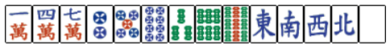

# Mahjong Analyzer

<!-- This is a Riichi Mahjong hand evaluation tool written in pure Haskell, including:
1. Winning hand validation.
2. Calculating shanten number.
3. Finding all partitions of a winning hand.
4. Calculating score of a winning hand based on its Han and Fu value.
5. Automatic checking using module QuickCheck. -->

Projek analisa tangan dari permainan Riichi Mahjong yang ditulis dalam Haskell, mencakup:
1. Validasi tangan kemenangan.
2. Menghitung nilai shanten.
3. Mencari semua partisi dari tangan kemenangan.
4. Menghitung skor dari tangan kemenangan berdasarkan nilai Han dan Fu nya.
5. Melakukan pengecekan secara otomatis menggunakan modul QuickCheck.

Kebanyakan dari algoritma di projek ini memanfaatkan DFS untuk mendekonstruksi tangan. Permasalahan DP juga sangat cocok dikerjakan menggunakan FP dengan sifat terkenalnya yaitu lazy evaluation (suatu operasi tidak akan dihitung hingga dibutuhkan), serta menggunakan teknik memoization unik dari Haskell, yaitu memoTree.

## Instalasi dan Build

Projek dikerjakan menggunakan [Cabal](https://www.haskell.org/cabal/) yang juga akan mengatur dependensi dari program.

### Build
```nginx
cabal build
```

### Jalankan Interaktif CLI
Akan diimplementasikan

### Jalankan Test Suite
```bash
cabal test
```

## Menghitung Shanten Menggunakan Memoization dengan Tree

Satu tangan dalam mahjong terdiri dari $14$ ubin. Shanten adalah banyak ubin minimum yang harus ditukar untuk menjadikan tangan siap menang (tenpai). Shanten bernilai 0 artinya tangan siap menang dan shanten bernilai -1 berarti tangan sudah menang.

Menghitung nilai shanten dapat dilakukan dengan mudah. 
Periksa kasus terburuk dari tangan yang mungkin, tangan ini memiliki nilai shanten $8$, salah satu contohnya sebagai berikut.
\
Setiap triplet dan sequence (selanjutnya akan disebut meld) mengantarkan 2 ubin menuju kemenangan, sedangkan pair dan proto meld (pmeld) hanya 1. Sehingga secara umum nilai shanten mengikuti formula
$$Shanten = 8 - 2*Melds - Pair - PMelds.$$
Permasalahan semakin rumit karena ada banyak cara memilih partisi (Melds, Pair, PMelds) dari tangan.
Jika dihitung dengan brute-force secara langsung, banyak kombinasi yang harus diperiksa akan membengkak, sehingga diperlukan optimasi.

## Mengapa Perlu Memoization?

Walaupun bentuk tangan berbeda, submasalah yang sama akan muncul secara berulang.
State yang sama dapat muncul dari urutan pemilihan meld yang berbeda, memoization mengurangi banyak perhitungan dari state tersebut.

Dalam pemrograman imperatif, memoization biasanya menggunakan *hash table* atau array.
Namu pada Haskell, ada teknik memoization unik yang memanfaatkan *lazy evaluation* dan *infinite tree structure*, yang dikenal sebagai **memoTree**.

## Konsep memoTree secara Singkat

Alih-alih menyimpan hasil perhitungan dalam tabel, Haskell membangun sebuah pohon tak hingga yang setiap nodenya mewakili hasil dari suatu fungsi pada indeks tertentu.
1. Buat pohon biner tak hingga yang berisi bilangan bulat tak negatif $0,1,2,3,\ldots$ di setiap node.
2. Terapkan *map* fungsi `f` ke setiap node secara langsung sehingga sekarang setiap node berisi nilai fungsi `f` pada indeksnya. Memo terbentuk.
3. Karena lazy evaluation, hal ini dapat terjadi dengan tanpa ada perhitungan sama sekali.
4. Untuk mendapatkan nilai `f n`, cukup periksa node ke `n` dari tree, yang dapat dilakukan dalam $O(\log n)$. Pada saat ini fungsi `f n` baru dihitung dan akan langsung melihat nilai `f m` yang dibutuhkan.

```hs
memoTree :: ((Int -> a) -> Int -> a) -> Int -> a
memoTree f = memoTree_f
    where memoTree_f = index memo
        memo = fmap (f memoTree_f) nats
```

Pendekatan ini bekerja tanpa mutable state, yang sesuai dengan filosofi Fp, memoization dilakukan tanpa cache manual serta berjalan otomatis hanya berdasarkan struktur pohon.

## Penerapan

Untuk menghitung shanten untuk suit tertentu, setiap suit direpresentasikan sebagai integer menggunakan encoding yang memanfaatkan basis $5$.
Dengan demikian:
- Setiap state tangan suit dapat dianggap sebagai bilangan `n`.
- memoShantenSuit n suit result memanggil memoTree pada penyelesaian state ke-$n$.
- memoTree memastikan setiap state tidak dihitung lebih dari sekali.
Dengan menggabungkan hasil per-suit:
```hs
Shanten(hand) = combine (Shanten Manzu) (Shanten Pinzu) ..
```
maka perhitungan shanten dapat dilakukan dengan lebih cepat karena memoization.